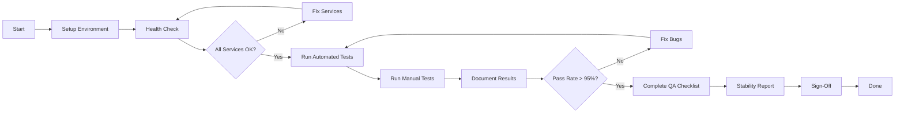

# Milestone 8: Quick Reference Guide

**Fast access to key testing information**

---

## 🚀 30-Second Setup

```bash
# Terminal 1: MongoDB
mongod

# Terminal 2: Backend
cd d:\Ps-3(git)\ShizishanGPT\src
python -m uvicorn main:app --reload --port 8000

# Terminal 3: Middleware
cd d:\Ps-3(git)\ShizishanGPT\middleware
node server.js

# Terminal 4: Frontend
cd d:\Ps-3(git)\ShizishanGPT\frontend
npm start

# Terminal 5: Run Tests
cd d:\Ps-3(git)\ShizishanGPT\tests
pytest -v
```

---

## 📋 Test Categories at a Glance

| # | Category | Tests | Priority | Time | Document |
|---|----------|-------|----------|------|----------|
| 1 | E2E Pipeline | 4 | 🔴 High | 10 min | [PART 1](./MILESTONE_8_TESTING_PLAN.md) |
| 2 | RAG Retrieval | 20 | 🔴 High | 20 min | [PART 1](./MILESTONE_8_TESTING_PLAN.md) |
| 3 | Mini LLM | 30 | 🔴 High | 30 min | [PART 2](./MILESTONE_8_TESTING_PLAN_PART2.md) |
| 4 | Yield Model | 30 | 🟡 Medium | 15 min | [PART 3](./MILESTONE_8_TESTING_PLAN_PART3.md) |
| 5 | Weather Model | 25 | 🟡 Medium | 15 min | [PART 3](./MILESTONE_8_TESTING_PLAN_PART3.md) |
| 6 | ReAct Agent | 35 | 🔴 High | 25 min | [PART 4](./MILESTONE_8_TESTING_PLAN_PART4.md) |
| 7 | Translation | 30 | 🟡 Medium | 15 min | [PART 4](./MILESTONE_8_TESTING_PLAN_PART4.md) |
| 8 | Image Handling | 30 | 🔴 High | 20 min | [PART 5](./MILESTONE_8_TESTING_PLAN_PART5.md) |
| 9 | Error Handling | 50 | 🔴 High | 30 min | [PART 5](./MILESTONE_8_TESTING_PLAN_PART5.md) |
| 10 | Performance | 15 | 🔴 High | 20 min | [PART 6](./MILESTONE_8_TESTING_PLAN_PART6.md) |
| 11 | Security | 20 | 🔴 High | 15 min | [PART 6](./MILESTONE_8_TESTING_PLAN_PART6.md) |

**Total: 289 tests | ~3.5 hours automated + 8-10 hours manual**

---

## ⚡ Critical Tests (Must Pass)

### 1. System Health
```bash
curl http://localhost:3000  # React
curl http://localhost:5000/health  # Middleware
curl http://localhost:8000/health  # Backend
```

### 2. LLM Functionality
```bash
curl -X POST http://localhost:5000/api/ask \
  -H "Content-Type: application/json" \
  -d '{"query": "What is crop rotation?"}'
```

### 3. RAG Retrieval
```bash
curl -X POST http://localhost:5000/api/rag \
  -H "Content-Type: application/json" \
  -d '{"query": "NPK fertilizers", "top_k": 5}'
```

### 4. Yield Prediction
```bash
curl -X POST http://localhost:5000/api/predict_yield \
  -H "Content-Type: application/json" \
  -d '{"crop": "wheat", "area": 10, "rainfall": 800}'
```

### 5. Weather Prediction
```bash
curl -X POST http://localhost:5000/api/predict_weather \
  -H "Content-Type: application/json" \
  -d '{"rainfall": 2000, "temperature": 35}'
```

---

## 🎯 Performance Targets

| Metric | Target | Max Acceptable |
|--------|--------|----------------|
| LLM Response | < 3s | < 5s |
| RAG Retrieval | < 2s | < 4s |
| Yield Model | < 1s | < 2s |
| Weather Model | < 1s | < 2s |
| Image Processing | < 2s | < 4s |
| Translation | < 1.5s | < 3s |
| Concurrent Users (10) | 100% | > 90% |
| Memory Total | < 6GB | < 10GB |
| Frontend Load | < 2s | < 4s |

---

## 🔒 Security Checklist (5 minutes)

```bash
# 1. Check no API keys in frontend
curl http://localhost:3000 | grep -i "api_key"  # Should find nothing

# 2. Check .env not in Git
git status | grep .env  # Should be in .gitignore

# 3. Test CORS (should be blocked)
curl -H "Origin: http://malicious-site.com" http://localhost:5000/api/ask

# 4. Test SQL injection prevention
curl -X POST http://localhost:5000/api/ask \
  -d '{"query": "' OR '1'='1"}'  # Should not break system

# 5. Test file upload validation
# Upload .exe file as .jpg - should reject
```

---

## 📊 Test Execution Commands

### Run Specific Test Category
```bash
# RAG tests only
pytest tests/test_rag.py -v

# LLM tests only
pytest tests/test_llm.py -v

# Model tests only
pytest tests/test_models.py -v

# Performance tests
pytest tests/test_performance.py -v

# Security tests
pytest tests/test_security.py -v
```

### Run with Coverage
```bash
pytest --cov=src --cov-report=html
```

### Run Specific Test
```bash
pytest tests/test_rag.py::TestRAG::test_rag_001_fertilizer_query -v
```

---

## 🐛 Common Issues & Fixes

| Issue | Cause | Fix |
|-------|-------|-----|
| "Connection refused" | Service not running | Start the service |
| "Model not found" | Model files missing | Check Model3/ directory |
| "MongoDB error" | MongoDB not running | Start `mongod` |
| "CORS error" | Wrong origin | Check CORS config in server.js |
| "Timeout" | Slow model inference | Increase timeout in config |
| "Memory error" | Large model files | Reduce batch size |
| "Import error" | Missing dependencies | `pip install -r requirements.txt` |

---

## 📝 Quick Test Data

### Sample Queries
```python
# RAG Tests
"What are NPK fertilizers?"
"How to do crop rotation?"
"Best irrigation methods?"

# LLM Tests  
"Explain crop rotation in simple terms"
"What is the benefit of organic farming?"
"How does weather affect crops?"

# Yield Tests
{"crop": "wheat", "area": 10, "rainfall": 800, "temperature": 25}
{"crop": "rice", "area": 5, "rainfall": 1500, "temperature": 30}

# Weather Tests
{"rainfall": 2000, "temperature": 35, "humidity": 80}
{"rainfall": 100, "temperature": 45, "humidity": 20}

# Translation Tests (Tamil)
"நெல் சாகுபடி எப்படி?"
"பூச்சி தாக்குதல் என்ன செய்வது?"
```

---

## 🔄 Test Workflow



---

## 📈 Test Reporting

### Quick Status Check
```bash
# Count passed tests
pytest --collect-only | grep "test session starts"

# Show only failures
pytest --tb=short -v

# Generate HTML report
pytest --html=report.html --self-contained-html
```

### Results Summary Template
```
MILESTONE 8 TEST RESULTS
========================
Date: [Date]
Tester: [Name]

AUTOMATED TESTS:
- RAG: XX/20 passed (XX%)
- LLM: XX/30 passed (XX%)
- Models: XX/55 passed (XX%)
- Performance: XX/15 passed (XX%)
- Security: XX/20 passed (XX%)
TOTAL: XXX/289 passed (XX%)

MANUAL TESTS:
- E2E: [Pass/Fail]
- Translation: [Pass/Fail]
- Image Upload: [Pass/Fail]
- Error Handling: [Pass/Fail]

PERFORMANCE:
- LLM: X.XXs (target < 5s)
- RAG: X.XXs (target < 4s)
- Memory: X.XXG (target < 10G)

CRITICAL ISSUES: [Count]
HIGH ISSUES: [Count]

DEPLOYMENT READY: [YES/NO]
```

---

## 🎯 Priority Testing (15 minutes)

If time is limited, test these critical paths:

1. **Frontend → Backend Flow** (2 min)
   - Open http://localhost:3000
   - Ask: "What is crop rotation?"
   - Verify response appears

2. **RAG Retrieval** (2 min)
   - Ask: "Information about NPK fertilizers"
   - Verify knowledge base content in response

3. **Model Predictions** (3 min)
   - Test yield prediction
   - Test weather prediction
   - Verify reasonable outputs

4. **Error Handling** (3 min)
   - Invalid input: negative area
   - Missing parameters
   - Verify error messages

5. **Performance** (5 min)
   - Time 5 requests
   - Check memory usage
   - Verify < 5s response time

---

## 📞 Emergency Troubleshooting

### System Won't Start
```bash
# Kill all node processes
taskkill /F /IM node.exe

# Kill Python processes
taskkill /F /IM python.exe

# Restart MongoDB
net stop MongoDB
net start MongoDB

# Clear node_modules and reinstall
cd middleware && rd /s /q node_modules && npm install
cd frontend && rd /s /q node_modules && npm install
```

### Tests Failing
```bash
# Update dependencies
pip install -r requirements.txt --upgrade
cd middleware && npm install
cd frontend && npm install

# Clear Python cache
rd /s /q __pycache__
rd /s /q .pytest_cache

# Reset database
mongo ShizishanGPT --eval "db.dropDatabase()"
```

---

## ✅ Final Go/No-Go Checklist

**MUST HAVE (P0):**
- [ ] All services start without errors
- [ ] Health endpoints return 200 OK
- [ ] LLM generates responses
- [ ] RAG retrieves relevant docs
- [ ] Models make predictions
- [ ] No critical security vulnerabilities
- [ ] Pass rate > 95%

**SHOULD HAVE (P1):**
- [ ] Performance within targets
- [ ] Translation works for all languages
- [ ] Image upload functional
- [ ] Error messages user-friendly
- [ ] Memory usage acceptable

**NICE TO HAVE (P2):**
- [ ] 100% test coverage
- [ ] All edge cases handled
- [ ] Comprehensive logging
- [ ] Performance optimized

**DECISION:** GO / NO-GO

---

## 📚 Document Links

- [Full Testing Plan Index](./README.md)
- [PART 1: E2E & RAG](./MILESTONE_8_TESTING_PLAN.md)
- [PART 2: LLM](./MILESTONE_8_TESTING_PLAN_PART2.md)
- [PART 3: Models](./MILESTONE_8_TESTING_PLAN_PART3.md)
- [PART 4: Agent & Translation](./MILESTONE_8_TESTING_PLAN_PART4.md)
- [PART 5: Images & Errors](./MILESTONE_8_TESTING_PLAN_PART5.md)
- [PART 6: Performance & Security](./MILESTONE_8_TESTING_PLAN_PART6.md)
- [PART 7: Deliverables](./MILESTONE_8_TESTING_PLAN_PART7.md)
- [Bug Report Template](./MILESTONE_8_TESTING_PLAN_PART7.md#122-bug-report-template)
- [QA Checklist](./MILESTONE_8_TESTING_PLAN_PART7.md#123-quality-assurance-checklist)

---

**Version:** 1.0  
**Last Updated:** 2024  
**Quick Access Guide for Milestone 8 Testing**
